[linkedin](https://linkedin.com/in/utkarshtripathi11) &nbsp;·&nbsp;
[x](https://x.com/chlochaltehai) &nbsp;·&nbsp;
[instagram](https://instagram.com/votkarsh) &nbsp;·&nbsp;
[email](mailto:utkarshtripathi2108@gmail.com)

> AI/ML and cloud-leaning software engineer, turning ideas into 
> real, industry-relevant builds while leveling up every layer of the stack.

Currently deep in AI & Machine Learning and generative AI, expanding into 
AWS and Azure, and sharpening data structures and algorithms alongside 
modern, scalable application development. Also picking up Salesforce and 
ServiceNow along the way. Always open to collaborating on impactful 
projects and learning in public.

<samp>python &nbsp; ai/ml &nbsp; generative ai &nbsp; aws &nbsp; azure &nbsp; salesforce &nbsp; servicenow &nbsp; dsa</samp>

Every graphic here is generated, not embedded from anyone else's server. 
`ascii.svg` is a photo pushed through a character ramp by 
[`scripts/make_portrait.py`](scripts/make_portrait.py); the stat graphics and 
these section headings are drawn by [a scheduled action](.github/workflows/stats.yml) 
straight from the GitHub GraphQL API, once a day, committing only what changed.

They animate with SMIL inside the SVG, because GitHub strips scripts from 
READMEs — and since nothing loads from a third party, nothing here can 
rate-limit or go dark. The headings are SVGs for the same reason: GitHub also 
strips CSS, so an image is the only way to put this page's own typeface on them.

The typeface is [JetBrains Mono](scripts/fonts), subset to just the characters 
each graphic draws and inlined as base64. That isn't only for looks: the 
portrait's grid assumes an advance width of exactly 0.600 em, and a viewer whose 
default monospace is narrower would otherwise see it squeezed.

Language totals cover public repositories only. `year.svg` uses the portrait's 
character ramp: `:` `+` `#` `@`, quiet to loud.
